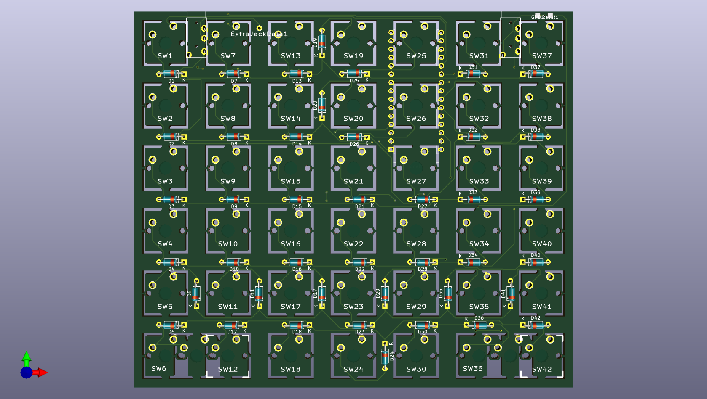

# Can Split Keyboard

Note: THIS KEYBOARD IS NOT READY FOR MANUFACTURING !!!

PCB design for split ortholinear keyboard with 7x6 keys on both sides. 

Can Split Keyboard is based on [Split
Infinitive](https://github.com/peej/for-split-keyboard).

The main differences are
* 7x6 keys on both sides (rather than 6x5) to enable a more complete
  key set. 
* Arduino Nano (rather than Pro Micro).

Inherited features:
* Designed to be easy to build with minimal soldering experience.
* Switch plate cutouts in the PCB so the same PCB can also be used as a switch plate.
* Serial communication over a TRRS cable in split configuration.
* Single PCB design for both keyboard sides.

## Bill of Materials (BOM)

* 4 PCBs, 2 for components and 2 as switch plates.
* 84 MX compatible switches.
* 84 1n4148 diodes.
* 2 Arduino Nano controllers with headers or DIP sockets.
* 2 PJ320A 3.5mm TRRS jacks.
* TRRS cable and micro USB cable.
* 84 MX compatible key caps.

### Tools

* Hacksaw blade or similar
* Flat edged file or sanding paper
* Soldering iron and solder

When uploading the gerber files to the manufacturer, use the default
PCB settings. The plate PCB thickness should be 1.6mm for the switches
to snap into the plate securely. 

## Construction

* You will need 4 PCBs.
* Use a hacksaw blade to remove the cutouts for the switch plate PCBs.
* Solder the diodes onto the underside of each PCB.
* Solder on the Arduino Nano headers (or DIP socket) onto the
  underside of each PCB, do not solder on the Arduino Nano yet.
* Solder the PJ320A TRRS sockets onto the underside of each PCB.
  * There are 2 positions per board, use the right position on the left hand PCB and the left position on the right hand PCB.
  * Ensure that the pins will not foul the placement of the switches and still allow the switches to sit flat on the PCB.
  * You may need to slightly bend the pins inwards away from the switch footprint.
* Insert the switches into the plate and then into the top of the PCBs.
  * Insert all the switches and ensure that the pins of each switch are correctly coming through the board and are not bent under the PCB.
* Solder all the switch pins.
* Solder on the Arduino Nano, ensure that you get them the correct way around, the chip side should be face down towards the PCB.
* Connect the halves together with the TRRS cable.
* Flash both Arduino Nanos with the firmware, see the [QMK documentation](http://qmk.fm/) on how to build and flash the firmware.
